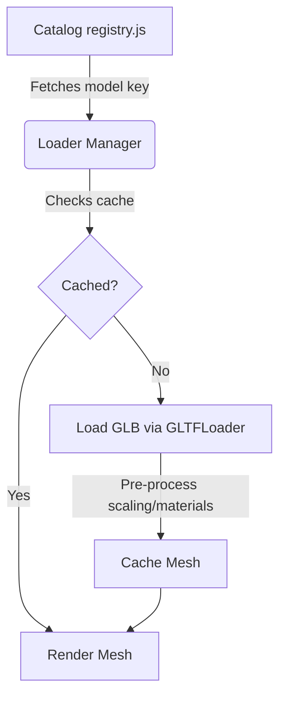

# 2D & 3D Model Assets Analysis for House Designer

This document outlines potential resources and technical pathways for introducing **more realistic views** and **greater variety** of 2D & 3D models in the house designer, without changing the codebase just yet.

---

## 🔍 How Models are Handled Today

Currently, the application relies on a **100% procedural design system**:
*   **3D Meshes** ([furniture3d.js](file:///home/jgarcairaza/code/micro-apps/apps/house-designer/src/lib/furniture3d.js)): Built dynamically at runtime using primitive geometries (`BoxGeometry`, `CylinderGeometry`, `SphereGeometry`) with custom canvas textures for wood/fabric finishes ([textures.js](file:///home/jgarcairaza/code/micro-apps/apps/house-designer/src/lib/textures.js)).
*   **2D Graphics** ([FurnitureGraphic.jsx](file:///home/jgarcairaza/code/micro-apps/apps/house-designer/src/components/FurnitureGraphic.jsx)): Rendered as top-down flat SVGs.

### The Big Trade-Off: Procedural vs. Static Assets

| Metric | Procedural (Current) | External Assets (GLTF / SVG Packs) |
| :--- | :--- | :--- |
| **Performance** | ⚡ **Instant load**, zero network overhead. | 🐌 Higher load times (each model is 100KB - 2MB). |
| **Resizing** | 📐 **Distortion-free resizing** (e.g., changing sofa width adds cushions/legs procedurally). | 🥴 **Stretches out of proportion** unless custom shaders/slicing is used. |
| **Aesthetics** | 🎨 Minimalist, cartoonish, low-poly. | 🏠 High-fidelity, extremely detailed, realistic textures. |
| **Variety** | 🛠️ Hardcoded in JS switches; manual work to add types. | 🛍️ Drag-and-drop third-party models from infinite catalogs. |

---

## 🌐 The Best Free 3D & 2D Resources

Here are the top-rated, free-to-use collections that match our categories:

### 1. 3D Models (GLTF / GLB)
Since the app uses vanilla Three.js, **`.gltf` or `.glb`** are the ideal formats. They load natively with Three.js's `GLTFLoader`.

*   **[KayKit: Furniture Bits (itch.io)](https://kaylousberg.itch.io/kaykit-furniture)** (CC0 / Public Domain)
    *   *Best for:* 50+ matching low-poly indoor items. Stylized, clean, and pre-optimized.
*   **[Kenney: Furniture Kit](https://kenney.nl/assets/furniture-kit)** (CC0)
    *   *Best for:* Extremely lightweight, beautifully organized modular home items (beds, chairs, tables).
*   **[Quaternius: Ultimate Furniture Pack](https://quaternius.com)** (CC0)
    *   *Best for:* Variety. Hundreds of modular assets across kitchen, bath, office, and living categories.
*   **[Sketchfab (Filter: Downloadable + CC0/CC-BY)](https://sketchfab.com)**
    *   *Best for:* Photorealistic single items (e.g., a specific designer leather sofa or detailed bathroom sink).
*   **[ambientCG](https://ambientcg.com)** & **[Poliigon](https://www.poliigon.com)**
    *   *Best for:* High-quality, seamless PBR texture maps (Wood, Leather, Marble, Fabric) if we stick to procedural models but want photorealism.

### 2. 2D Symbols (SVG / Vectors)
Modern architectural blue-prints use highly standardized, clean vector silhouettes:

*   **[SVG Repo](https://www.svgrepo.com)**
    *   *Best for:* Searching for terms like "furniture floor plan" or "sofa top view". High quality, clean SVG files.
*   **[Rayon CAD Blocks](https://rayon.design)**
    *   *Best for:* Real-world architectural design styles. You can reference their layouts for modern, elegant, clean-lined symbols.
*   **[The Noun Project](https://thenounproject.com)**
    *   *Best for:* Minimalist, black-and-white, highly recognizable vector stencils.

---

## 🚀 Two Pathways Forward

### Pathway 1: Upgraded Procedural Models (Highly Recommended)
We keep the current architecture but make it look **premium and detailed** using advanced Three.js features and SVG filters.

*   **3D Enhancements:**
    1.  **Beveled Corners:** Replace `BoxGeometry` with `RoundedBoxGeometry` (using a helper or the `three-rounded-box` utility). Sharp digital corners look fake; rounded edges capture realistic light glints.
    2.  **Advanced PBR Materials:** Swap `MeshStandardMaterial` for `MeshPhysicalMaterial` to get effects like clearcoat (for shiny bathroom ceramics), sheen/roughness maps (for fabric/wood), and ambient occlusion.
    3.  **Detailed Subcomponents:** Procedurally generate pillows with curved vertices (`SphereGeometry` squeezed) or organic plant leaves, rather than simple shapes.
*   **2D Enhancements:**
    1.  **Drop Shadows:** Implement CSS/SVG `<feDropShadow>` filters on elements in [FurnitureGraphic.jsx](file:///home/jgarcairaza/code/micro-apps/apps/house-designer/src/components/FurnitureGraphic.jsx). This gives the symbols an architectural sense of depth.
    2.  **Pattern Fills:** Apply CSS gradients or repeating patterns (such as wood stripes or fabric checks) to make the flat colors look textured.

### Pathway 2: External GLTF/GLB Loader
We refactor the renderer to load real 3D model files.

To prevent **scaling distortion** when users resize furniture in this path, we can implement:
1.  **Uniform Scaling Only:** Lock the width/depth aspect ratio so resizing scales the item evenly in all directions.
2.  **Dynamic 3D Assembly:** For tables/desks, load the leg meshes and tabletop mesh as separate GLB sub-models. The app then repositions the legs to the corners of the user's custom width/depth and scales the tabletop slab accordingly, avoiding fat/stretched legs.
3.  **Ortho-rendered 2D Views:** Instead of manually writing SVGs, use an orthographic camera pointing straight down on the 3D model, take a snapshot/render of it, and project it as a 2D floor plan element.

---

### 💬 Recommendations & Discussion
*   If **smooth performance and real-time custom resizing** are critical, **Pathway 1 (Procedural Upgrade)** is the safest and most elegant. We can dramatically improve the aesthetics of current procedural shapes by applying beveled boxes, rich colors, and soft shadows.
*   If **photorealism and rich variety** (unique styles of sofas, plants, sinks) are the main priority, **Pathway 2 (GLTF Loading)** is ideal. We would need to source and optimize around 30 low-poly `.glb` assets and place them in the project's `public/` directory.
