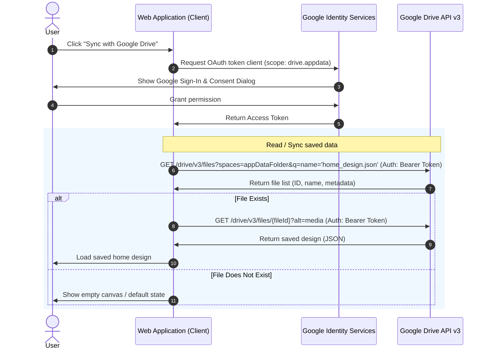

# Decentralized Application Storage via Google Drive `appDataFolder`

When building client-side applications (such as a Home Designer, a markdown editor, or a drawing app) without a centralized database, you can leverage the user's personal cloud storage. 

Google Drive API provides a specialized, hidden folder called the **Application Data Folder** (`appDataFolder`). This folder is designed specifically for storing application configuration files, state, or user-generated documents (like saved house designs) privately.

---

## What is the `appDataFolder`?

The Application Data Folder is a hidden directory in the user's Google Drive that:
*   **Is completely hidden from the user:** The user cannot see or modify the files within this folder directly through the Google Drive web or mobile UI. This prevents accidental deletion or modification of application state.
*   **Is app-exclusive:** Your application is the only one that can access files stored in its specific `appDataFolder`. Other apps cannot read or write to it, ensuring privacy and security.
*   **Tied to user quota:** The files count against the user's Google Drive storage quota.
*   **Clean Uninstall:** If a user disconnects your app from their Google Drive settings, Google automatically deletes all files in your app's `appDataFolder`.

---

## System Architecture & Authentication Flow

To access this folder from a purely client-side application (e.g., a static HTML/JS web app or a single-page app), you use the **Google Identity Services (GIS)** SDK to obtain a temporary OAuth 2.0 access token, and then interact with the **Google Drive API v3** using standard HTTP `fetch` requests.

### Authentication & File Sync Sequence



---

## Client-Side Implementation Guide

Here is a modern JavaScript implementation utilizing standard `fetch` calls and Google Identity Services.

### 1. Include the Library
Add the Google Identity Services client script to your HTML file:
```html
<script src="https://accounts.google.com/gsi/client" async defer></script>
```

### 2. Initialize the Auth Client
Configure the token client with your **Google OAuth 2.0 Client ID** and the required scope `https://www.googleapis.com/auth/drive.appdata`.

```javascript
let accessToken = null;
let tokenClient = null;

function initGoogleAuth() {
  tokenClient = google.accounts.oauth2.initTokenClient({
    client_id: 'YOUR_GOOGLE_CLIENT_ID.apps.googleusercontent.com',
    scope: 'https://www.googleapis.com/auth/drive.appdata',
    callback: (tokenResponse) => {
      if (tokenResponse.error) {
        console.error('Auth Error:', tokenResponse);
        return;
      }
      accessToken = tokenResponse.access_token;
      console.log('Successfully authorized with Google Drive!');
      // Trigger sync or file load after authentication
      syncAppData();
    },
  });
}

function handleAuthClick() {
  if (accessToken === null) {
    // Prompt the user to log in and authorize
    tokenClient.requestAccessToken({ prompt: 'consent' });
  } else {
    // Skip prompt if already authenticated
    tokenClient.requestAccessToken({ prompt: '' });
  }
}
```

### 3. Fetching / Searching for Files
To check if a saved design file already exists in the `appDataFolder`:

```javascript
async function findFileInAppData(fileName) {
  const url = new URL('https://www.googleapis.com/drive/v3/files');
  url.searchParams.append('spaces', 'appDataFolder');
  url.searchParams.append('q', `name = '${fileName}' and trashed = false`);
  url.searchParams.append('fields', 'files(id, name, modifiedTime)');

  const response = await fetch(url, {
    headers: {
      'Authorization': `Bearer ${accessToken}`
    }
  });

  const result = await response.json();
  return result.files && result.files.length > 0 ? result.files[0] : null;
}
```

### 4. Reading File Content
To download the contents of a specific file by its file ID:

```javascript
async function downloadFileContent(fileId) {
  const response = await fetch(`https://www.googleapis.com/drive/v3/files/${fileId}?alt=media`, {
    headers: {
      'Authorization': `Bearer ${accessToken}`
    }
  });

  if (!response.ok) {
    throw new Error('Failed to retrieve file content');
  }

  return await response.json(); // Or .text() depending on your save format
}
```

### 5. Saving / Creating Files
Creating a file in the appDataFolder requires a multipart upload to send both the metadata (filename, target folder) and the file content in a single request.

```javascript
async function createSaveFile(fileName, dataObject) {
  const metadata = {
    name: fileName,
    parents: ['appDataFolder']
  };

  const fileContent = JSON.stringify(dataObject);
  const boundary = 'foo_bar_boundary';
  
  // Construct the multipart body
  const multipartBody = 
    `\r\n--${boundary}\r\n` +
    `Content-Type: application/json; charset=UTF-8\r\n\r\n` +
    `${JSON.stringify(metadata)}\r\n` +
    `--${boundary}\r\n` +
    `Content-Type: application/json\r\n\r\n` +
    `${fileContent}\r\n` +
    `--${boundary}--`;

  const response = await fetch('https://www.googleapis.com/upload/drive/v3/files?uploadType=multipart', {
    method: 'POST',
    headers: {
      'Authorization': `Bearer ${accessToken}`,
      'Content-Type': `multipart/related; boundary=${boundary}`
    },
    body: multipartBody
  });

  if (!response.ok) {
    throw new Error('Failed to create file on Google Drive');
  }

  const result = await response.json();
  return result.id;
}
```

### 6. Updating an Existing File
If the file already exists, perform a `PATCH` request to update its content instead of creating a duplicate:

```javascript
async function updateSaveFile(fileId, dataObject) {
  const fileContent = JSON.stringify(dataObject);

  const response = await fetch(`https://www.googleapis.com/upload/drive/v3/files/${fileId}?uploadType=media`, {
    method: 'PATCH',
    headers: {
      'Authorization': `Bearer ${accessToken}`,
      'Content-Type': 'application/json'
    },
    body: fileContent
  });

  if (!response.ok) {
    throw new Error('Failed to update file on Google Drive');
  }

  const result = await response.json();
  return result;
}
```

---

## Comparison of Decentralized Storage Strategies

Depending on target audiences and ecosystem choices, other decentralized options may also be viable:

| Approach | Authentication | Target Storage Location | Accessibility / Sync | Pros | Cons |
| :--- | :--- | :--- | :--- | :--- | :--- |
| **Google Drive `appDataFolder`** | OAuth 2.0 (Google Identity) | User's Hidden Google Drive folder | Automatic across devices (logged into Google) | Highly secure, hidden from user, no server DB needed, matches most users' existing accounts. | Requires Google login, API can have quota limits, restricted to Google ecosystem. |
| **Dropbox App Folder** | OAuth 2.0 (Dropbox) | User's `/Apps/<AppName>` folder | Automatic across devices (logged into Dropbox) | Easy to implement, visible to user (users can easily inspect/backup files themselves). | Requires Dropbox account (less common than Google). |
| **GitHub Gists** | Personal Access Token / OAuth | Public/Secret GitHub Gist | Across devices with Git | Developers love it, version history included natively. | Only targets developer audiences; users must generate GitHub credentials. |
| **remotestorage.io** | OpenAuth protocol | Custom third-party storage providers | Syncs across remotestorage-enabled providers | Fully open source, vendor-neutral protocol. | Low user adoption; requires users to set up a WebDAV/remotestorage account. |
| **IndexedDB + Manual Export** | None | Local browser memory | Local device only (cannot sync automatically) | No configuration or authentication needed; works instantly offline. | Data is lost if browser cache is cleared; no cross-device sync without manual file exports. |

---

> [!IMPORTANT]
> **Google Verification Requirement**
> If your application is in "Testing" status in the Google Cloud Console, only defined test accounts can authenticate. Before exposing the feature to external users, your app must submit for OAuth verification. Because the `drive.appdata` scope is classified as a **sensitive scope**, the verification process may require a brief review by Google.

> [!TIP]
> **Optimizing Offline & Sync Experience**
> The best design pattern is to use **IndexedDB** as your primary local storage. Whenever a user modifies their design, save it instantly to IndexedDB. Then, trigger a background sync to `appDataFolder` in the background (or display a simple "Syncing..." status indicator) to ensure your app stays fast, works offline, and preserves data during network drops.
